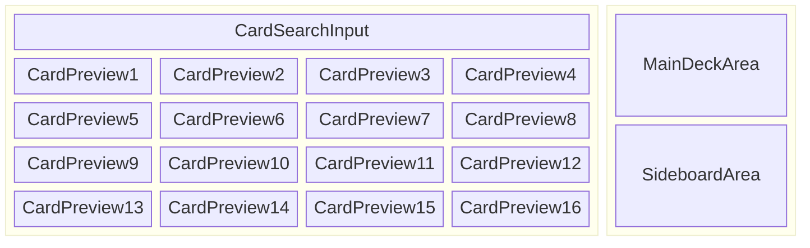

# 仕様書

## 📦 技術スタック

このプロジェクトは Hono フレームワークベースのフルスタック Web アプリケーションです：

- **フレームワーク**: Hono + HonoX（ファイルベースルーティング）
- **フロントエンド**: Hono JSX（React風の構文）+ TypeScript
- **スタイリング**: Tailwind CSS v4
- **ランタイム**: Cloudflare Workers
- **ビルドツール**: Vite
- **開発・デプロイ**: Wrangler
- **API**: Scryfall API（カードデータ取得用）

### アーキテクチャ

- `app/routes/`: ページルート（HonoXのファイルベースルーティング）
- `app/islands/`: クライアントサイドでハイドレートされるコンポーネント
- `app/client.ts`: クライアントサイドエントリーポイント
- `app/server.ts`: サーバーサイドエントリーポイント

---

## 🧩 機能仕様（Features）

### レイアウト

### MVP に含めるもの

- [x] **カード検索機能**
  - [x] カード名による検索
  - [x] カードテキスト（oracle text）による検索
  - [x] 色による検索（白/青/黒/赤/緑の組み合わせ）
  - [x] タイプによる検索（クリーチャー、インスタント、ソーサリー等）
  - [x] マナコストによる検索（0-15）
  - [x] フォーマットによる検索（スタンダード、パイオニア、モダン等）

- [x] **カード検索結果の表示**
  - [x] ページネーション機能（16枚ずつ表示）
  - [x] カード画像、カード名、マナコスト、タイプの表示
  - [x] 前/次ページボタンと現在ページ/総ページ数の表示

- [x] **デッキ構築機能**
  - [x] ドラッグ＆ドロップでのカード追加
  - [x] メインデッキとサイドボード間でのドラッグ＆ドロップ移動
  - [x] カード数量の増減ボタン（+/-）
  - [x] カード移動ボタン（→S / →M）

- [x] **デッキ管理機能**
  - [x] デッキサイズ制限の表示（メインデッキ60枚、サイドボード15枚）
  - [x] カード枚数制限（同名カード4枚まで）
  - [x] デッキ名の編集機能
  - [x] ローカルストレージでのデッキ保存

- [x] **エクスポート機能**
  - [x] MTGA インポート形式でのテキスト出力
  - [x] クリップボードへのコピー機能

- [ ] **インポート機能**（未実装）
  - [ ] デッキコードからのインポート機能

## 🎯 実装済み機能（2025年8月版）

上記のMVP機能はすべて実装完了しており、以下の追加機能も含まれています：

### 検索機能の詳細
- **複合検索**: 複数フィルターの組み合わせ検索が可能
- **リアルタイム検索**: フィルター変更時の即座の検索実行
- **カードテキスト検索**: キーワード能力（「飛行」「速攻」等）での検索
- **詳細フィルターUI**: 色ボタン、ドロップダウン選択式の直感的なUI

### デッキ構築機能の詳細
- **ドラッグ＆ドロップ対応**:
  - 検索結果からデッキへの追加（copyエフェクト）
  - メインデッキ⇔サイドボード間の移動（moveエフェクト）
  - ドラッグ中の視覚的フィードバック
- **カード管理**:
  - 1枚ずつの追加/削除
  - 1枚ずつの移動（メインデッキ⇔サイドボード）
  - リアルタイムでのデッキ状態更新

### 技術的特徴
- **型安全性**: TypeScript + ESLint strictルールによる型安全な実装
- **テスト駆動開発**: Vitest による単体テスト完備
- **SSR対応**: サーバーサイドレンダリング環境でのlocalStorage安全な利用
- **コード品質**: Prettier + ESLint + Husky による自動フォーマット・品質管理

---

### 将来的に追加予定（後回し）

- [ ] アカウント機能（ログイン・デッキ保存）
- [ ] デッキの共有URL発行
- [ ] デッキコードからのインポート機能
- [ ] 複数デッキの管理機能
- [ ] デッキ統計・分析機能

---

## 🔒 制約・前提条件

- サーバー不要なクライアントのみの構成で MVP を実装する。
- デッキの保存はローカルストレージで行う。（初期段階では）
- カード情報は Scryfall API から取得し、DB やキャッシュは用いない（初期段階では）。
- MTGA に対応するカードセット・言語のみ対象とする（基本は英語カード）。

---

## 📄 用語定義

| 用語       | 定義                                             |
|----------|------------------------------------------------|
| MTGA     | Magic: The Gathering Arena の略称                 |
| メインデッキ   | プレイヤーが構築するカードの組み合わせ。60枚以上                      |
| サイドボード   | プレイヤーが構築するカードの組み合わせ。15枚以下                      |
| エクスポート   | デッキを MTGA にインポート可能な形式のテキストに変換して出力する機能          |
| Scryfall | MTG カード情報 API（ https://scryfall.com/docs/api ） |

---

## 📌 参考情報（Useful Links）

- MTGA インポート形式: https://mtgarena-support.wizards.com/hc/en-us/articles/360035441192
- Scryfall API: https://scryfall.com/docs/api
- Hono ドキュメント: https://hono.dev/
- HonoX ドキュメント: https://github.com/honojs/honox
