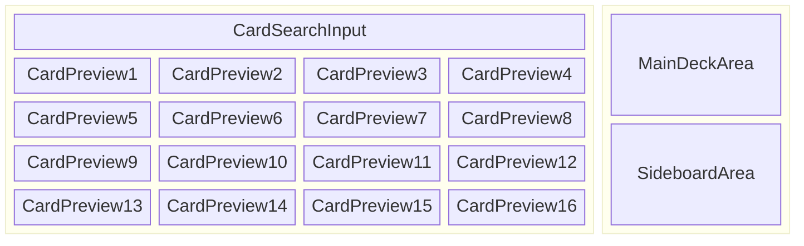

# 仕様書

## 📦 技術スタック

このプロジェクトは Hono フレームワークベースのフルスタック Web アプリケーションです：

- **フレームワーク**: Hono + HonoX（ファイルベースルーティング）
- **フロントエンド**: Hono JSX（React風の構文）+ TypeScript
- **スタイリング**: Tailwind CSS v4
- **ランタイム**: Cloudflare Workers
- **ビルドツール**: Vite
- **開発・デプロイ**: Wrangler
- **API**: Scryfall API（カードデータ取得用）

### アーキテクチャ

- `app/routes/`: ページルート（HonoXのファイルベースルーティング）
- `app/islands/`: クライアントサイドでハイドレートされるコンポーネント
- `app/client.ts`: クライアントサイドエントリーポイント
- `app/server.ts`: サーバーサイドエントリーポイント

---

## 🧩 機能仕様（Features）

### レイアウト

### MVP に含めるもの

- [x] **カード検索機能**
  - [x] カード名による検索
  - [x] カードテキスト（oracle text）による検索
  - [x] 色による検索（白/青/黒/赤/緑/無色の組み合わせ）
  - [x] タイプによる検索（クリーチャー、インスタント、ソーサリー等）
  - [x] マナコストによる検索（0-15）
  - [x] フォーマットによる検索（スタンダード、パイオニア、ヒストリック、アルケミー）

- [x] **カード検索結果の表示**
  - [x] ページネーション機能（16枚ずつ表示）
  - [x] カード画像、カード名、マナコスト、タイプの表示
  - [x] カードの色に応じた枠色表示（単色・多色・無色の視覚的区別）
  - [x] レスポンシブグリッドレイアウト（2〜4列）
  - [x] 前/次ページボタンと現在ページ/総ページ数の表示

- [x] **デッキ構築機能**
  - [x] ドラッグ＆ドロップでのカード追加
  - [x] メインデッキとサイドボード間でのドラッグ＆ドロップ移動
  - [x] カード数量の増減ボタン（+/-）
  - [x] カード移動ボタン（→S / →M）

- [x] **デッキ管理機能**
  - [x] MTGルール準拠のデッキサイズ制限（メインデッキ60枚以上、サイドボード15枚以下）
  - [x] MTGルール準拠のカード枚数制限（メイン+サイドボード合計で同名カード4枚まで、Basic Land例外あり）
  - [x] デッキ名の編集機能
  - [x] ローカルストレージでのデッキ保存
  - [x] ルール違反時の赤色エラー表示
  - [x] **複数デッキ管理機能**（2025年8月追加）
    - [x] デッキ一覧表示
    - [x] デッキの新規作成・編集・削除
    - [x] URL ベースルーティング（`/`、`/deck/new`、`/deck/[id]`）
    - [x] デッキに使用されている色のマーカー表示

- [x] **エクスポート機能**
  - [x] MTGA インポート形式でのテキスト出力
  - [x] クリップボードへのコピー機能

- [ ] **インポート機能**（未実装）
  - [ ] デッキコードからのインポート機能

## 🎯 実装済み機能（2025年8月版）

上記のMVP機能はすべて実装完了しており、以下の追加機能も含まれています：

### 複数デッキ管理システム

**完全実装済み**（2025年8月）:

- **デッキ一覧ページ** (`/`): 保存済みデッキの一覧表示
  - デッキ名、カード枚数、作成日・更新日の表示
  - デッキに使用されている色マーカー（W/U/B/R/G）の表示
  - 各デッキの編集・削除リンク
  - MTGルール適合状況の視覚的表示（60枚未満は赤色表示）

- **URL ベースルーティング**:
  - `/` - デッキ一覧ページ
  - `/deck/new` - 新規デッキ作成ページ
  - `/deck/[id]` - デッキ編集ページ

- **デッキ管理操作**:
  - 新規デッキ作成（空のデッキから開始）
  - 既存デッキの編集（カード追加・削除・移動）
  - デッキ削除（確認ダイアログ付き）
  - 自動保存（カード追加/削除時に即座に保存）

### 検索機能の詳細
- **複合検索**: 複数フィルターの組み合わせ検索が可能
- **リアルタイム検索**: フィルター変更時の即座の検索実行（テキストは500msデバウンス）
- **カードテキスト検索**: キーワード能力（「飛行」「速攻」等）での検索
- **詳細フィルターUI**: コンパクトな6列グリッドレイアウト（色選択3列、その他各1列）
- **無色カード対応**: 無色(C)カードの検索とフィルタリング

### デッキ構築機能の詳細
- **ドラッグ＆ドロップ対応**:
  - 検索結果からデッキへの追加（copyエフェクト）
  - メインデッキ⇔サイドボード間の移動（moveエフェクト）
  - ドラッグ中の視覚的フィードバック
- **カード管理**:
  - 1枚ずつの追加/削除
  - 1枚ずつの移動（メインデッキ⇔サイドボード）
  - リアルタイムでのデッキ状態更新

### UI/UX機能
- **レスポンシブデザイン**: 全画面横幅対応（max-width制限なし）
- **視覚的フィードバック**: カード色に応じた枠色表示
- **コンパクトUI**: 詳細フィルター部分の高さ最適化
- **両面カード対応**: Dual-faced cardの画像表示
- **独立スクロールシステム** (2025年8月追加):
  - カード検索結果の独立スクロール（検索UI固定、カード一覧のみスクロール）
  - デッキビルダーの独立スクロール（ヘッダー固定、デッキ内容のみスクロール）
  - ページ全体のスクロールを完全に回避する設計
- **最適化されたレイアウト**: ヘッダーとpadding最適化でコンテンツ領域を最大化

### MTGルール準拠機能
- **正確なカード制限**: メインデッキ+サイドボード合計で同名カード4枚まで
- **基本土地例外処理**: Basic Landは4枚制限の対象外
- **デッキサイズ制限**: メインデッキ60枚以上、サイドボード15枚以下
- **色識別システム**: カードのcolor_identityに基づく色分析・表示
  - **カラーアイデンティティベース**: 表示色はcard.color_identityを参照（MTGルール準拠）
- **検索機能**: カード検索はcard.colorsフィルターを使用（検索利便性を重視）
- **改良された色表現** (2025年8月更新): 白を薄いグレー、多色を黄色、無色を茶色系に変更

### 技術的特徴
- **型安全性**: TypeScript + ESLint strictルールによる型安全な実装
- **テスト駆動開発**: Vitest による単体テスト完備（37テスト、モック化済み）
- **サービス層分離**: 
  - `DeckService`: 純粋なデッキ操作ロジック（永続化なし）
  - `DeckManagerService`: デッキ永続化・CRUD操作専用
- **ユーティリティ分離** (2025年8月追加): 日付、デッキ計算、色管理の各種ユーティリティ関数を分離
- **コンポーネント化** (2025年8月追加): ColorCircle等のJSXコンポーネント化による再利用性向上
- **SSR対応**: サーバーサイドレンダリング環境でのlocalStorage安全な利用
- **コード品質**: Prettier + ESLint + Husky による自動フォーマット・品質管理
- **Git管理**: 機能毎の小単位コミット、日本語コミットメッセージ

---

### 将来的に追加予定（後回し）

- [ ] アカウント機能（ログイン・デッキ保存）
- [ ] デッキの共有URL発行
- [ ] デッキコードからのインポート機能
- [ ] デッキ統計・分析機能（マナカーブ、色分布等）
- [ ] デッキのタグ付け・カテゴリ分類機能
- [ ] デッキ履歴・バージョン管理機能

---

## 🔒 制約・前提条件

- サーバー不要なクライアントのみの構成で MVP を実装する。
- デッキの保存はローカルストレージで行う。（初期段階では）
- カード情報は Scryfall API から取得し、DB やキャッシュは用いない（初期段階では）。
- MTGA に対応するカードセット・言語のみ対象とする（基本は英語カード）。

---

## 📄 用語定義

| 用語       | 定義                                             |
|----------|------------------------------------------------|
| MTGA     | Magic: The Gathering Arena の略称                 |
| メインデッキ   | プレイヤーが構築するカードの組み合わせ。60枚以上                      |
| サイドボード   | プレイヤーが構築するカードの組み合わせ。15枚以下                      |
| エクスポート   | デッキを MTGA にインポート可能な形式のテキストに変換して出力する機能          |
| Scryfall | MTG カード情報 API（ https://scryfall.com/docs/api ） |

---

## 📌 参考情報（Useful Links）

- MTGA インポート形式: https://mtgarena-support.wizards.com/hc/en-us/articles/360035441192
- Scryfall API: https://scryfall.com/docs/api
- Hono ドキュメント: https://hono.dev/
- HonoX ドキュメント: https://github.com/honojs/honox
